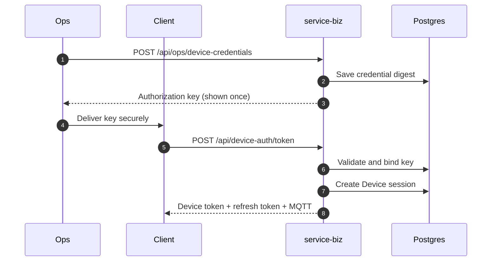
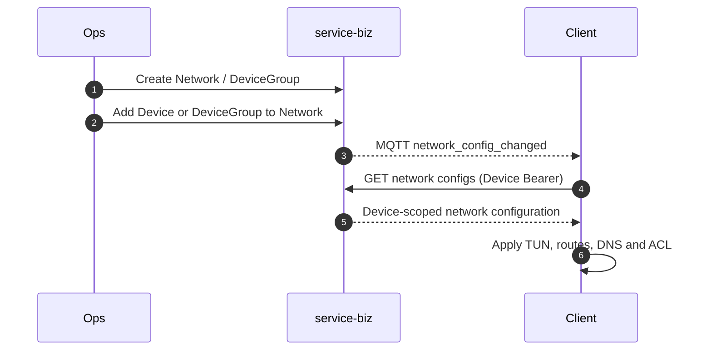
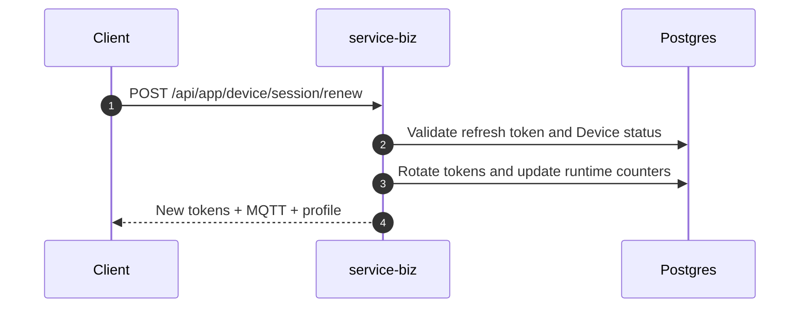
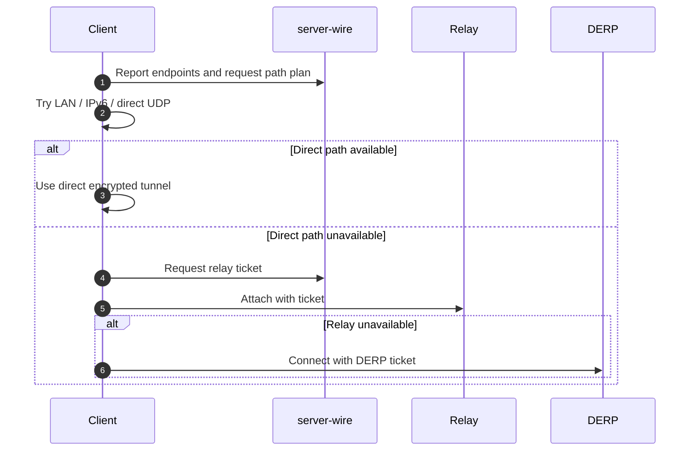

# Main Sequence Diagrams

## Device Activation

```mermaid
sequenceDiagram
    autonumber
    participant Ops
    participant Client
    participant Biz as service-biz
    participant DB as Postgres

    Ops->>Biz: POST /api/ops/device-credentials
    Biz->>DB: Save credential digest
    Biz-->>Ops: Authorization key (shown once)
    Ops->>Client: Deliver key securely
    Client->>Biz: POST /api/device-auth/token
    Biz->>DB: Validate and bind key
    Biz->>DB: Create Device session
    Biz-->>Client: Device token + refresh token + MQTT
```

## Network Assignment

```mermaid
sequenceDiagram
    autonumber
    participant Ops
    participant Biz as service-biz
    participant Client

    Ops->>Biz: Create Network / DeviceGroup
    Ops->>Biz: Add Device or DeviceGroup to Network
    Biz-->>Client: MQTT network_config_changed
    Client->>Biz: GET network configs (Device Bearer)
    Biz-->>Client: Device-scoped network configuration
    Client->>Client: Apply TUN, routes, DNS and ACL
```

## Session Renewal

```mermaid
sequenceDiagram
    autonumber
    participant Client
    participant Biz as service-biz
    participant DB as Postgres

    Client->>Biz: POST /api/app/device/session/renew
    Biz->>DB: Validate refresh token and Device status
    Biz->>DB: Rotate tokens and update runtime counters
    Biz-->>Client: New tokens + MQTT + profile
```

## Path Selection

```mermaid
sequenceDiagram
    autonumber
    participant Client
    participant Wire as server-wire
    participant Relay
    participant DERP

    Client->>Wire: Report endpoints and request path plan
    Client->>Client: Try LAN / IPv6 / direct UDP
    alt Direct path available
        Client->>Client: Use direct encrypted tunnel
    else Direct path unavailable
        Client->>Wire: Request relay ticket
        Client->>Relay: Attach with ticket
        alt Relay unavailable
            Client->>DERP: Connect with DERP ticket
        end
    end
```
