# 主要序列图

本文档集中整理程序当前主链路所需的主要序列图，统一使用当前接口与节点视角命名。

覆盖范围：

- 用户注册与登录
- 设备注册与节点注册
- 网络创建与设备入网
- 节点启动配置获取
- 控制通道建立与网络地图同步
- P2P 直连尝试
- Relay 回退建连
- 断开与状态收敛

## 1. 用户注册与登录

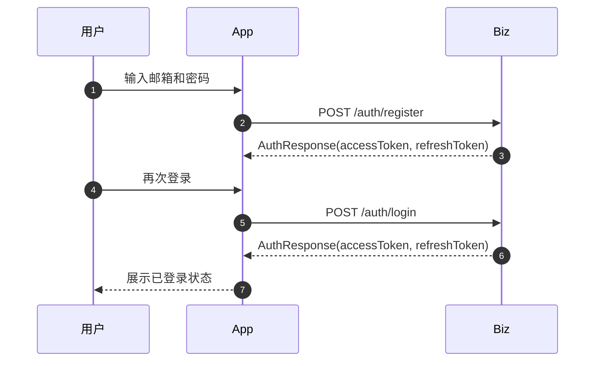

## 2. 设备注册与节点注册

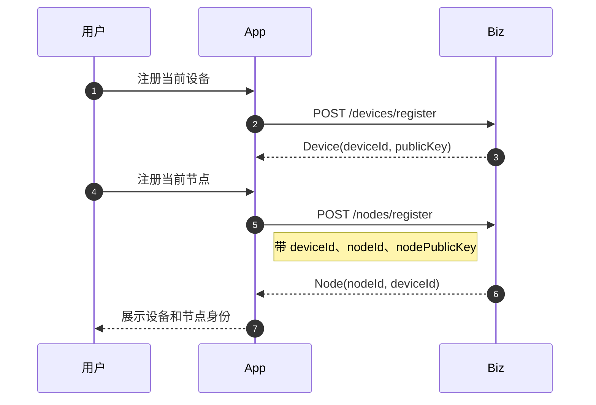

## 2.1 用户登录到设备入网（端到端）

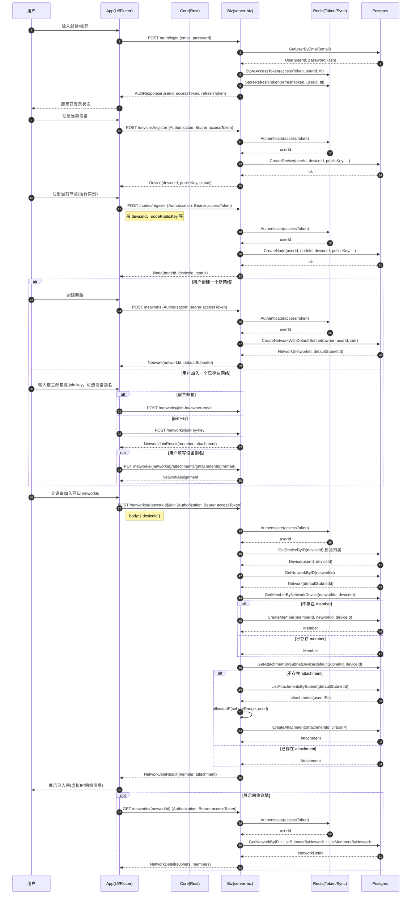

## 3. 网络创建与设备加入网络

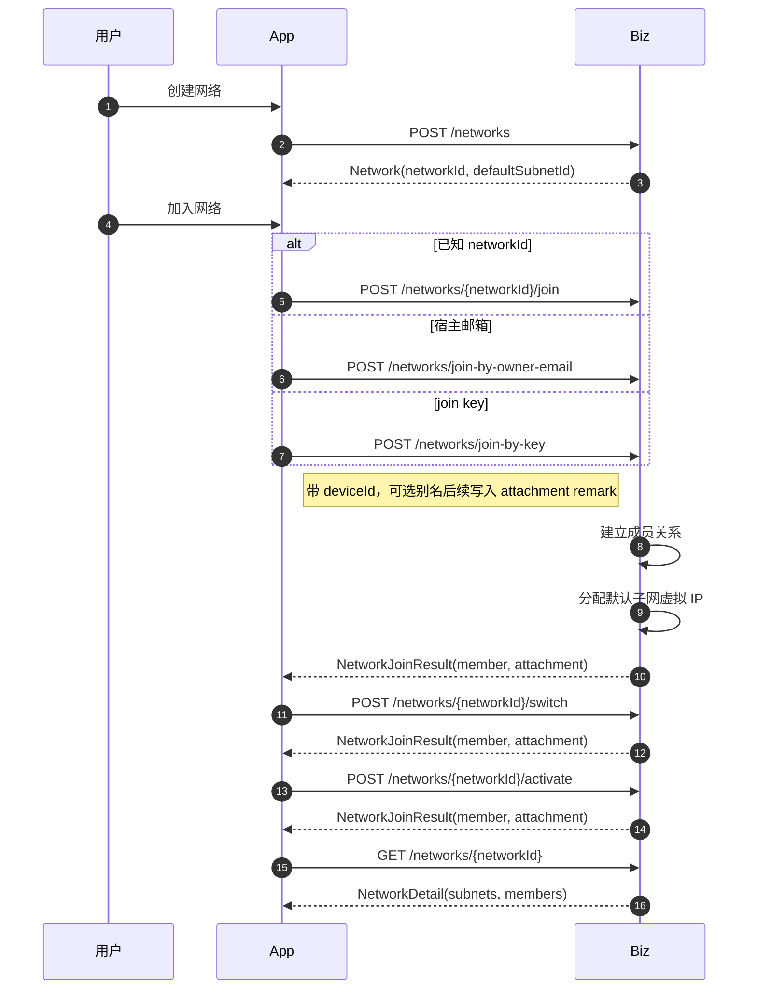

## 4. 节点获取启动配置

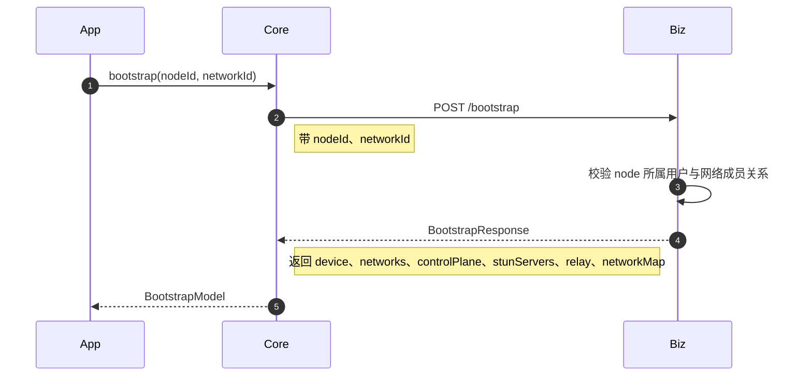

## 5. 控制通道建立与网络地图同步

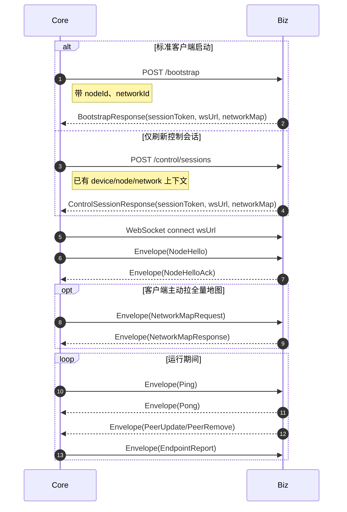

## 6. P2P 直连尝试

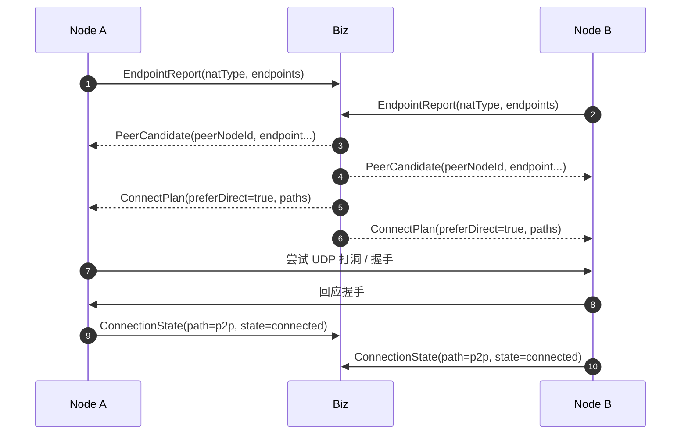

## 7. Relay 回退建连

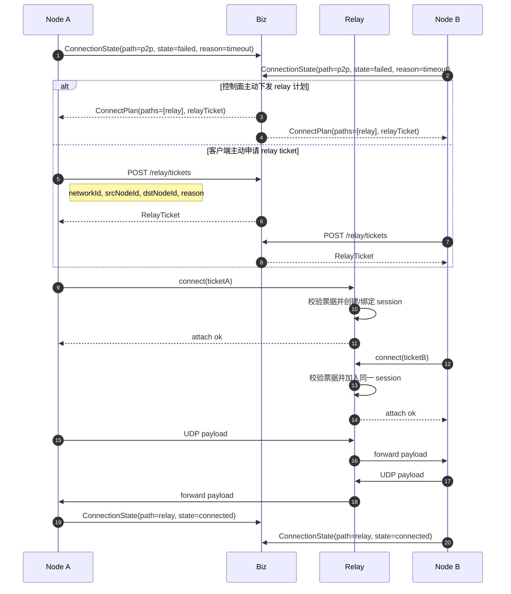

## 8. 隧道建立与业务数据收发

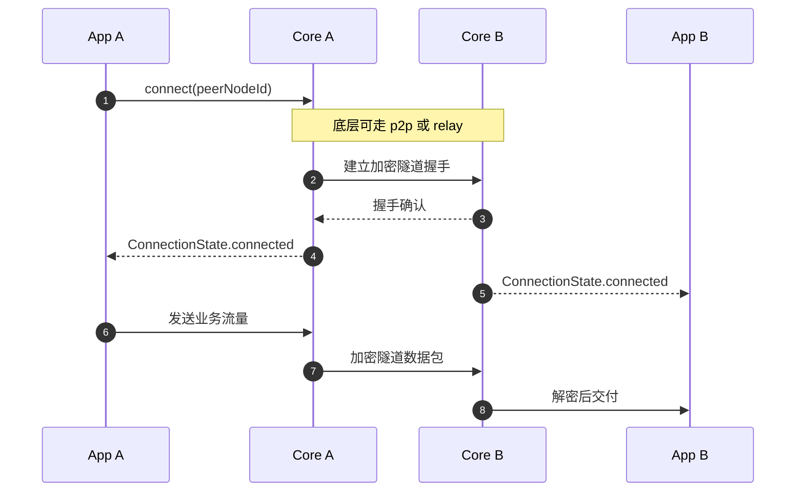

## 9. 断开与状态收敛

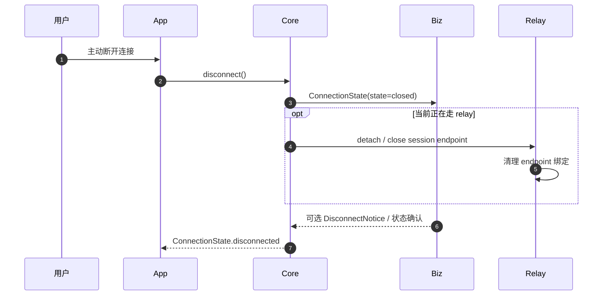

## 10. 主链路总览

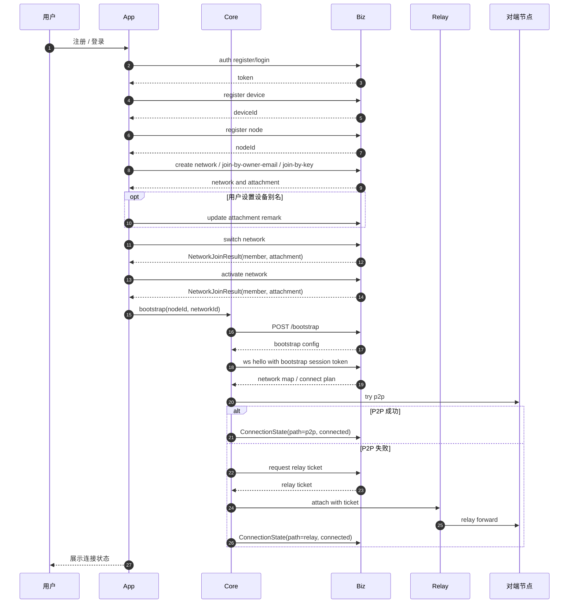

## 11. 建议阅读顺序

1. 先看“主链路总览”
2. 再看“设备注册与节点注册”以及“网络创建与设备加入网络”
3. 然后看“节点获取启动配置”和“控制通道建立与网络地图同步”
4. 最后看“P2P 直连尝试”和“Relay 回退建连”
